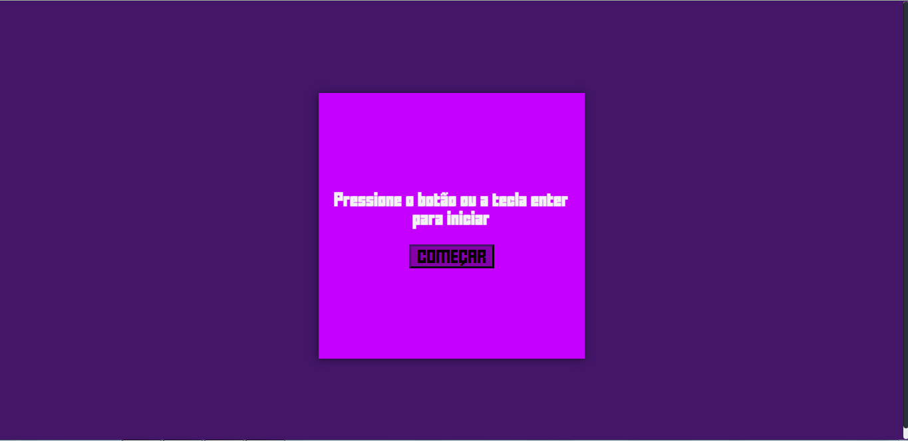

# Efeito de digitacao

---

## Sobre

Este é projeto simples, com objetivo de testar um dos efeitos que eu mais gosto de ver nos sites. Aproveitando a oportunidade para usar media query para deixa o projeto responsivo.

---

## Como instalar ou visualizar

Para instalar você apenas deve intalar os arquivos. A instalação pode ser pelo github ou esse [link](https://github.com/Ewerton-Tv/efeito-de-digitacao/archive/refs/heads/main.zip)

Você pode ver por esse [link](https://ewerton-tv.github.io/efeito-de-digitacao/)
